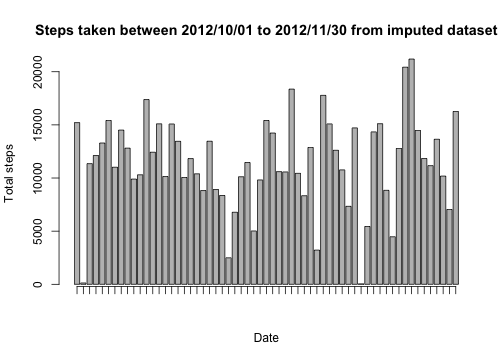
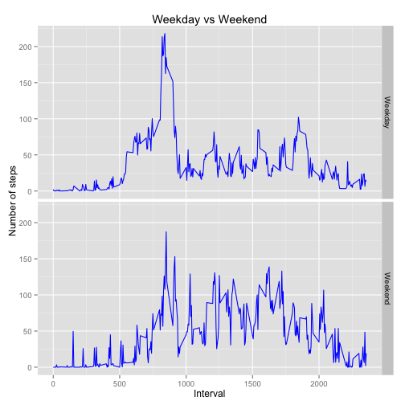

# Reproducible Research: Peer Assessment 1
Author: BellyTheMagnificent  
[Linkedin](https://www.linkedin.com/pub/lee-chun-wai/24/8/8b6/)    
Date: 2014-06-14  

## Loading and preprocessing the data  
Read data from csv file.  
If the file is not available in the current directory, download from github and unzip it.

```r
fileName = "activity.csv"
if (!file.exists(fileName)) {
    url <- "https://github.com/BellyTheMagnificent/RepData_PeerAssessment1/blob/master/activity.zip"
    zipName <- "activity.zip"
    download.file(url, zipName, method = "curl")
    unzip(zipName)
}

activity <- read.csv(fileName, stringsAsFactors = FALSE)
```

Convert the date to date data type  
        1.Convert 'date' column to date data type  
        2.Get weekday name from converted date column  
        3.Combine date and interval into datetime  

```r
activity$date = as.Date(activity$date, "%Y-%m-%d")
activity$day = weekdays(activity$date)
activity$datetime = strptime(paste(activity$date, activity$interval, sep = " "), 
    "%Y-%m-%d %H%M", tz = "GMT")
```

Data frame after prepoccess 

```
## 'data.frame':	17568 obs. of  5 variables:
##  $ steps   : int  NA NA NA NA NA NA NA NA NA NA ...
##  $ date    : Date, format: "2012-10-01" "2012-10-01" ...
##  $ interval: int  0 5 10 15 20 25 30 35 40 45 ...
##  $ day     : chr  "Monday" "Monday" "Monday" "Monday" ...
##  $ datetime: POSIXlt, format: NA NA ...
```


## What is mean total number of steps taken per day?
First, let look at the histogram of the total number of steps taken each day. The date with 0 steps due to no data were collected on the particular day.

```r
bplot = barplot(tapply(activity$steps, activity$date, sum, na.rm = T), ylab = "Total steps", 
    xlab = "Date", main = "Steps taken between 2012/10/01 to 2012/11/30", xaxt = "n")
axis(1, at = bplot, labels = F)
```

 

### Mean

```r
meanSteps = mean(tapply(activity$steps, activity$date, sum, na.rm = T))
```

The mean of the steps taken each day is 9354.2295.

### Median

```r
medianSteps = median(tapply(activity$steps, activity$date, sum, na.rm = T))
```

The median is 10395.  

## What is the average daily activity pattern?

To view the average daily activity pattern, first have to create a aggregate data set.

```r
aggByInterval = aggregate(steps ~ interval, data = activity, mean)
str(aggByInterval)
```

```
## 'data.frame':	288 obs. of  2 variables:
##  $ interval: int  0 5 10 15 20 25 30 35 40 45 ...
##  $ steps   : num  1.717 0.3396 0.1321 0.1509 0.0755 ...
```

Then we can plot the data using ggplot2. 

```r
library(ggplot2)
ggplot(aggByInterval, aes(interval, steps), title = "average number of steps taken") + 
    geom_line() + labs(title = "Average number of steps taken on particular interval")
```

 


### Which 5-minute interval have highest steps count? Let's find out.

```r
aggByInterval[which.max(aggByInterval$steps), ]
```

```
##     interval steps
## 104      835 206.2
```


#### The interval 835 has the highest number of average steps per day.  

## Imputing missing values
The data set is not completed. There are some rows do not have steps recorded.

```r
summary(activity$steps)
```

```
##    Min. 1st Qu.  Median    Mean 3rd Qu.    Max.    NA's 
##     0.0     0.0     0.0    37.4    12.0   806.0    2304
```

Base on the summary above, we found there is 2304 records are having NA as the values for steps column.

To fill out the missing values, we will use MICE library to fill the missing data.

```r
library(Rcpp)
library(mice)
```

Let's impute the data using mice package, it could take some time.

```r
set.seed(123)
imputecol = setdiff(names(activity), c("date", "datetime"))
imputeset = complete(mice(activity[imputecol]))
```

```
## 
##  iter imp variable
##   1   1  steps
##   1   2  steps
##   1   3  steps
##   1   4  steps
##   1   5  steps
##   2   1  steps
##   2   2  steps
##   2   3  steps
##   2   4  steps
##   2   5  steps
##   3   1  steps
##   3   2  steps
##   3   3  steps
##   3   4  steps
##   3   5  steps
##   4   1  steps
##   4   2  steps
##   4   3  steps
##   4   4  steps
##   4   5  steps
##   5   1  steps
##   5   2  steps
##   5   3  steps
##   5   4  steps
##   5   5  steps
```

```r
imputeset$date = activity$date
imputeset$datetime = activity$datetime
summary(imputeset)
```

```
##      steps          interval        day                 date           
##  Min.   :  0.0   Min.   :   0   Length:17568       Min.   :2012-10-01  
##  1st Qu.:  0.0   1st Qu.: 589   Class :character   1st Qu.:2012-10-16  
##  Median :  0.0   Median :1178   Mode  :character   Median :2012-10-31  
##  Mean   : 39.7   Mean   :1178                      Mean   :2012-10-31  
##  3rd Qu.: 16.0   3rd Qu.:1766                      3rd Qu.:2012-11-15  
##  Max.   :806.0   Max.   :2355                      Max.   :2012-11-30  
##     datetime                  
##  Min.   :2012-10-01 00:00:00  
##  1st Qu.:2012-10-16 12:38:45  
##  Median :2012-10-31 19:37:30  
##  Mean   :2012-10-31 19:37:30  
##  3rd Qu.:2012-11-16 02:36:15  
##  Max.   :2012-12-01 15:15:00
```

Now there is no NA value in the 'steps' column. (alternatively, the impute can be done by replacing the missing value with interval mean value).


```r
bplot = barplot(tapply(imputeset$steps, imputeset$date, sum, na.rm = T), ylab = "Total steps", 
    xlab = "Date", main = "Steps taken between 2012/10/01 to 2012/11/30 from imputed dataset", 
    xaxt = "n")
axis(1, at = bplot, labels = F)
```

 

### Mean of imputed data

```r
meanSteps = mean(tapply(imputeset$steps, imputeset$date, sum, na.rm = T))
```

The mean of the steps taken each day is 1.1422 &times; 10<sup>4</sup>.

### Median of imputed data

```r
medianSteps = median(tapply(imputeset$steps, imputeset$date, sum, na.rm = T))
```

The median is 11458.  

## Are there differences in activity patterns between weekdays and weekends?
First, create the new factor variable in the imputset data frame.

```r
imputeset$weekEndDay[imputeset$day %in% c("Saturday", "Sunday")] = "Weekend"
imputeset$weekEndDay[which(is.na(imputeset$weekEndDay))] = "Weekday"
imputeset$weekEndDay = as.factor(imputeset$weekEndDay)

table(imputeset$day, imputeset$weekEndDay)
```

```
##            
##             Weekday Weekend
##   Friday       2592       0
##   Monday       2592       0
##   Saturday        0    2304
##   Sunday          0    2304
##   Thursday     2592       0
##   Tuesday      2592       0
##   Wednesday    2592       0
```


Calculate new aggregate data frame  

```r
aggByInterval_new = aggregate(steps ~ interval + weekEndDay, data = imputeset, 
    mean)
str(aggByInterval_new)
```

```
## 'data.frame':	576 obs. of  3 variables:
##  $ interval  : int  0 5 10 15 20 25 30 35 40 45 ...
##  $ weekEndDay: Factor w/ 2 levels "Weekday","Weekend": 1 1 1 1 1 1 1 1 1 1 ...
##  $ steps     : num  2.2 0.4 0.3333 0.1778 0.0889 ...
```

Plot the graph using lattice package  

```r
library(lattice)

ggplot(aggByInterval_new) + geom_line(aes(x = interval, y = steps), colour = "blue") + 
    facet_grid(weekEndDay ~ .) + labs(title = "Weekday vs Weekend", x = "Interval", 
    y = "Number of steps")
```

 


Comparing the plots, we can see that the total steps taken during
weekends are, on average, greater than that taken during weekday, particularly around
midday.
