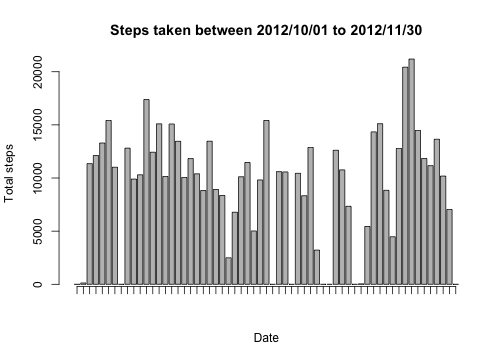
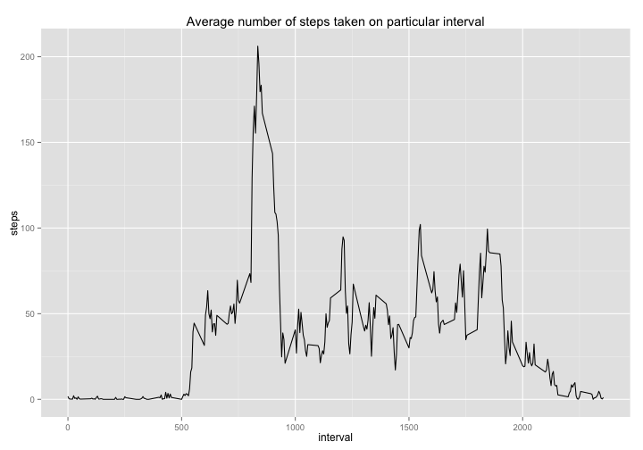

# Reproducible Research: Peer Assessment 1
Author: BellyTheMagnificent  
[Linkedin](https://www.linkedin.com/pub/lee-chun-wai/24/8/8b6/)    
Date: 2014-06-14  

## Loading and preprocessing the data  
Read data from csv file.  
If the file is not available in the current directory, download from github and unzip it.

```r
fileName = "activity.csv"
if (!file.exists(fileName)) {
    url <- "https://github.com/BellyTheMagnificent/RepData_PeerAssessment1/blob/master/activity.zip"
    zipName <- "activity.zip"
    download.file(url, zipName, method = "curl")
    unzip(zipName)
}

activity <- read.csv(fileName, stringsAsFactors = FALSE)
```

Convert the date to date data type  
        1.Convert 'date' column to date data type  
        2.Get weekday name from converted date column  
        3.Combine date and interval into datetime  

```r
activity$date = as.Date(activity$date, "%Y-%m-%d")
activity$day = as.character(activity$date, "%a")
activity$datetime = strptime(paste(activity$date, "00:00:00", sep = " "), "%Y-%m-%d %H:%M:%S", 
    tz = "GMT") + activity$interval * 60
```

Data frame after prepoccess 

```
## 'data.frame':	17568 obs. of  5 variables:
##  $ steps   : int  NA NA NA NA NA NA NA NA NA NA ...
##  $ date    : Date, format: "2012-10-01" "2012-10-01" ...
##  $ interval: int  0 5 10 15 20 25 30 35 40 45 ...
##  $ day     : chr  "Mon" "Mon" "Mon" "Mon" ...
##  $ datetime: POSIXct, format: "2012-10-01 00:00:00" "2012-10-01 00:05:00" ...
```


## What is mean total number of steps taken per day?
First, let look at the histogram of the total number of steps taken each day. The date with 0 steps due to no data were collected on the particular day.

```r
bplot = barplot(tapply(activity$steps, activity$date, sum, na.rm = T), ylab = "Total steps", 
    xlab = "Date", main = "Steps taken between 2012/10/01 to 2012/11/30", xaxt = "n")
axis(1, at = bplot, labels = F)
```

 

### Mean

```r
meanSteps = mean(tapply(activity$steps, activity$date, sum, na.rm = T))
```

The mean of the steps taken each day is 9354.2295.

### Median

```r
medianSteps = median(tapply(activity$steps, activity$date, sum, na.rm = T))
```

The median is 10395.  

## What is the average daily activity pattern?

To view the average daily activity pattern, first have to create a aggregate data set.

```r
aggByInterval = aggregate(steps ~ interval, data = activity, mean)
str(aggByInterval)
```

```
## 'data.frame':	288 obs. of  2 variables:
##  $ interval: int  0 5 10 15 20 25 30 35 40 45 ...
##  $ steps   : num  1.717 0.3396 0.1321 0.1509 0.0755 ...
```

Then we can plot the data using ggplot2. 

```r
library(ggplot2)
ggplot(aggByInterval, aes(interval, steps), title = "average number of steps taken") + 
    geom_line() + labs(title = "Average number of steps taken on particular interval")
```

 


### Which 5-minute interval have highest steps count? Let's find out.

```r
aggByInterval[which.max(aggByInterval$steps), ]
```

```
##     interval steps
## 104      835 206.2
```


#### The interval 835 has the highest number of average steps per day.  
We can convert this interval to time to check the exact period about it.

```r
datetime = as.character(strptime("2010-01-01 00:00:00", "%Y-%m-%d %H:%M:%S", 
    tz = "GMT") + 835 * 60, "%I:%M %p")
```

The time for this interval is 01:55 PM.  


## Imputing missing values
The data set is not completed. There are some rows do not have steps recorded.

```r
summary(activity$steps)
```

```
##    Min. 1st Qu.  Median    Mean 3rd Qu.    Max.    NA's 
##     0.0     0.0     0.0    37.4    12.0   806.0    2304
```

Base on the summary above, we found there is 2304 records are having NA as the values for steps column.


## Are there differences in activity patterns between weekdays and weekends?
